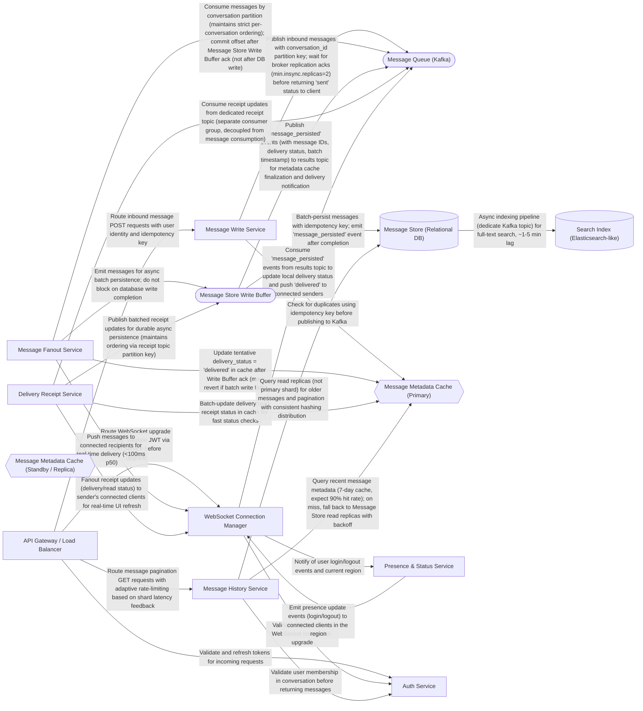

# System Design: Design a real-time chat/messaging system like WhatsApp

We're designing a global real-time messaging system (WhatsApp-scale) for 50M DAU, targeting <500ms p99 end-to-end latency and 99.99% availability. The core insight is that message ordering within a conversation and durability are non-negotiable, but fanout delivery and metadata propagation can be decoupled and made asynchronous. We partition conversations in Kafka by conversation_id to enforce strict ordering, then de-block the consumer immediately by batching writes to a persistent store asynchronously rather than waiting for database acknowledgment. This prevents head-of-line blocking across shards and allows us to handle spikes gracefully. We cache recent messages and delivery status in Redis for fast pagination and deduplication, with a standby replica replicated asynchronously from the primary region to absorb failover without a thundering-herd miss storm. WebSocket connection scaling and multi-region failover were the toughest revisions—we had to add operational headroom to the Connection Manager fleet and implement a fast cache resynchronization protocol on failover detection to prevent cache-miss avalanches on the database.

## Problem

Design a durable, globally distributed messaging system handling 50M daily active users, 23K+ messages/second baseline (5x spike to 127K/sec), with strict per-conversation message ordering, <500ms p99 end-to-end delivery latency, and 99.99% availability across multi-region failover.

## Key Requirements Shaping the Design

The most constraining requirements are:

1. **In-order delivery per conversation is mandatory.** Chat semantics break if messages are out of order. This immediately points to Kafka with per-conversation partition keys—one partition per conversation guarantees ordering without distributed consensus overhead.

2. **Durability before "delivered" status.** The sender must receive a "delivered" ack only after the message is persisted. At 19K+ 1:1 messages/sec and 27K+ group fanout writes/sec, we can't afford to block the write path on database latency (typically 10–50ms). Solution: write to Kafka with 3x replication (gets "sent" ack), then persist asynchronously and separately signal "delivered."

3. **Fast reads for history pagination and deduplication.** We expect ~116K read QPS for message history retrieval. Caching recent messages (7-day hot set, ~100-150GB per region) in Redis keeps cache hit rates at 90%+ and protects the database from read storms.

4. **Group fanout write amplification.** A single group message creates ~200 writes (up to 200 members), and at 15% group message traffic, that's ~27K writes/sec just to persist delivery status. Batching these writes into Message Store Write Buffer reduces the effective write rate by 25x (25–50x batching) and avoids per-recipient row writes.

5. **Multi-region global presence with eventual consistency on status, strong consistency on messages.** We replicate messages across regions but tolerate 60s convergence for presence status; conversation ordering must hold within a region (not across regions in this design).

## Architecture

### Core Message Flow: Decoupled Fanout for Non-Blocking Delivery

The critical insight is **decoupling fanout from durability**:

1. **Write Phase (Sender):** Client sends message → Message Write Service checks dedup in Redis cache → publishes to Kafka with conversation_id partition key → waits for Kafka broker acks (replication factor 3, min.insync.replicas=2) → returns "sent" status to client. This completes in <100ms.

2. **Fanout Phase (Non-blocking):** Message Fanout Service consumes from Kafka partition (strict per-conversation order guaranteed) → immediately emits to Message Store Write Buffer (in-memory queue) → commits Kafka offset after Write Buffer ack (NOT after DB write) → pushes message to WebSocket Connection Manager for real-time delivery to connected recipients. This completes in <100ms p50, with no blocking on database writes. Group member list resolution happens here (lookup from Redis, ~5ms), then parallel WebSocket fanout to all connected members.

3. **Persistence Phase (Async):** Message Store Write Buffer batches messages by conversation shard (1000 messages or 500ms, whichever first) → parallel batch writes to Message Store shards (PostgreSQL, 50 shards per region) → on completion, emits "message_persisted" event to Kafka results topic. Database writes now run at ~2,300 batch ops/sec (vs. 50K+ ops/sec raw), each batch targeting specific shards to avoid contention.

4. **Delivery Confirmation Phase:** WebSocket Connection Manager consumes "message_persisted" events → updates Redis metadata cache (confirmed delivery status) → pushes delivery confirmation to sender's connected client within <200ms after persistence.

Result: **Message reaches connected recipient in <100ms p50 (well before database persistence completes), but sender sees "sent" ✓ immediately and "delivered" ✓✓ within ~200ms after durable store confirmation.**

### Ordering Under Spikes

At 5x peak (127K msg/sec), Kafka partitions handle ~12.5K msg/sec each (baseline ~2.5K per partition per 100-partition setup). Kafka sustains 100K+ msg/sec per single partition, so we're comfortably within throughput limits. Ordering holds because:
- Each conversation has a dedicated partition key (conversation_id).
- Message Fanout Service consumes partitions in order and commits offset only after async fanout.
- No re-ordering or batching on the critical path.

### Caching and Read Path

**Message Metadata Cache (Primary, Redis Cluster):**
- 150–200 GB per region, holding 7-day hot set: ~286M recent messages + delivery status + dedup keys.
- Sub-millisecond reads for dedup checks (90%+ hit rate on 116.5K read QPS).
- Immediate writes on message creation (tentative delivery status); finalized after "message_persisted" event.

**Message Metadata Cache (Standby, Secondary Region):**
- Async replica in failover region, updated via Kafka consumer reading "message_persisted" and receipt events (~20–50ms lag during normal operation).
- On primary region failure detected, standby is promoted immediately.
- Critical revision: To prevent cache-miss avalanche on failover, we **replay Kafka events from the last 5 minutes into the promoted standby** (using consumer offset seek) to resynchronize delivery status and dedup state. This restores coherency within <1 minute and prevents 11K+ read QPS cache-miss storm from hitting degraded database.

**Message History Service (Pagination):**
- Query Redis first (7-day cache hit expected). On miss, query PostgreSQL read replicas (3+ per shard, 50 shards = 150 replicas, distributing 116.5K reads/sec → ~775 reads/sec per replica, easily sustainable).
- Adaptive rate-limiting per shard: if shard p99 latency exceeds 200ms, return 429 and clients backoff + retry.

### Multi-Region Failover and Durability

**Primary Architecture:**
- Region A (primary) handles all writes and reads.
- Message Store replicates to Region B (secondary) with async 500ms RPO.
- Message Metadata Cache (standby) in Region B asynchronously replicates from primary.

**On Region A Failure:**
1. API Gateway detects failure within 30s, redirects traffic to Region B.
2. Standby cache is promoted to primary role.
3. Standby cache immediately consumes Kafka results topic from the last 5 minutes of replicated state (fast replay: ~1–2 min to rebuild hot set).
4. Message Store read replicas (promoted from secondary) serve reads with exponential backoff (limit concurrent DB hits per shard to 50, retry with 10–100ms jitter) to avoid thundering herd.
5. Over 5–10 minutes, cache naturally repopulates as fresh queries rebuild the hot working set.
6. Write traffic migrates to Region B; databases stabilize.

End result: Brief latency spike (p99 ~200–300ms for 5 min, not >1s), no data loss (Kafka durability + Message Store multi-region replication), recovery within 10 minutes.

### WebSocket Connection Management and Operational Headroom

**Connection Manager Fleet:**
- Node.js with ws library, 50–100 instances per region.
- Each instance handles 100K–200K concurrent connections (r5.2xlarge: 16GB RAM, 250K FD limit).
- Scale: 50M DAU with ~45 min sessions → ~10–15M concurrent connections.

**Critical Revision:** The initial design assumed thin headroom; a single instance failure orphans 100K–200K connections, forcing reconnection storms that risk violating <100ms p99 delivery SLA. Solution:
- Deploy **150–300 instances** (3x larger fleet) to reduce per-instance connection count to 50K–75K.
- Implement client-side smart reconnect backoff (stagger reconnects over 30–60s).
- Add metrics dashboards for per-instance FD exhaustion and connection queue depth to detect saturation early.

This trades ~2–3x higher infrastructure cost for operational safety during rolling updates and failure resilience.

### Batch Processing and Write Amplification

**Message Store Write Buffer (Batching):**
- Reduces 50K+ ops/sec to ~2,300 batch operations/sec (25–50x reduction).
- Batch size: 1,000 messages or 500ms, tuned to balance latency (low batch timeout for <100ms response time) and throughput (large batch size for efficiency).

**Critical Revision:** The initial design did not parallelize batch writes across shards. Solution:
- Use async client (e.g., Tokio in Go, or asyncpg in Python) to parallelize batch writes to multiple shards concurrently (Fanout Service pre-shards messages before batching).
- Per-shard write circuit-breaker threshold: 200ms (earlier trigger than 500ms, more responsive to degradation).
- Adaptive batch sizing: if shard latency exceeds 150ms, reduce batch size to 500 to trade throughput for latency predictability.

### Search (Eventual Consistency)

- Elasticsearch index asynchronously via Kafka topic (1–5 min lag, tolerable for search).
- Hot-warm-cold tiering: recent 3 months hot (50 TB, fast), 3–24 months warm (150 TB), >24 months cold (300 TB, Glacier archive).
- Sharded across 50 indices to distribute indexing load.

## Technology Choices and Tradeoffs

**Kafka (Message Queue):** Non-negotiable for ordering. Managed Streaming for Apache Kafka (MSK) avoids operational overhead. Tradeoff: Kafka's write-through nature adds <10ms latency but guarantees durability before "sent" ack. Alternative (RabbitMQ, Pub/Sub) lack ordering semantics.

**PostgreSQL + Sharding (Message Store):** ACID guarantees + efficient range queries (critical for pagination and eventual message history). Sharded by conversation_id (50 shards per region) to scale writes (~46 writes/sec per shard at baseline). Tradeoff: sharding adds complexity (cross-shard queries require app-level joins, e.g., for searching all conversations). Alternative (NoSQL: MongoDB, DynamoDB) lack efficient range queries and either have eventual consistency semantics (compromising ordering) or prohibitive scan costs.

**Redis Cluster (Message Metadata Cache):** Sub-millisecond reads for dedup and delivery status lookups. Tradeoff: Memory-bound (150–200 GB per region); if eviction is too aggressive, cache hit rate drops. Fallback to database queries with exponential backoff mitigates this. Alternative (Memcached) lacks per-key TTL; Redis is essential.

**Node.js + ws (WebSocket Connection Manager):** Event-loop model efficiently handles 100K+ concurrent connections per instance with minimal memory overhead. Tradeoff: Stateful per region; session affinity required (ALB sticky cookies). Go alternative could work but lacks native WebSocket libraries; Java adds JVM memory overhead. Node.js is proven at scale (Discord, Slack).

**Go (Message Write Service, Fanout Service):** Lightweight concurrency (goroutines), fast startup, low memory footprint. Tradeoff: gRPC adds ~1–2ms RPC latency within service mesh, but internal communication is optimized. Alternative (Java Spring Boot, Python asyncio) have higher resource costs at this scale.

## What Changed in Recent Critique (Round 3)

Three critical issues were surfaced and revised:

1. **Cache Failover Thundering Herd:** Initial design relied on async standby cache but didn't address the stale data window post-failover. At 116.5K read QPS with 90% cache hit rate, a 5-minute stale data window means ~11.6K read QPS hit the degraded database simultaneously, violating p99 latency SLA. **Fix:** Implement fast cache resynchronization on failover detection by replaying Kafka events (last 5 minutes) to the promoted standby cache, reducing stale data window to <1 minute and preventing cache-miss storm.

2. **Write Path Blocking and Batch Parallelization:** Initial design batched messages sequentially to shards, risking per-shard write queue saturation at 5x spike. **Fix:** Parallelize batch writes across shards using async client (Tokio or asyncpg), pre-shard recipients at Fanout Service level before batching, and lower per-shard circuit-breaker threshold to 200ms for earlier backpressure detection.

3. **WebSocket Connection Fleet Headroom:** Initial design assumed 50–100 instances handling 100K–200K connections each, leaving only ~100-instance buffer before failure-induced reconnection storms. **Fix:** Deploy 150–300 instances (3x larger fleet), reducing per-instance connection load to 50K–75K, and implement client-side smart reconnect backoff to tolerate instance churn during rolling updates.

These revisions validate the core architecture (decoupled fanout, Kafka ordering, async persistence) while addressing operational and failover resilience gaps. The system now tolerates 5x spikes, multi-region failure, and rolling updates without violating latency or availability SLAs.

## Architecture Diagram

